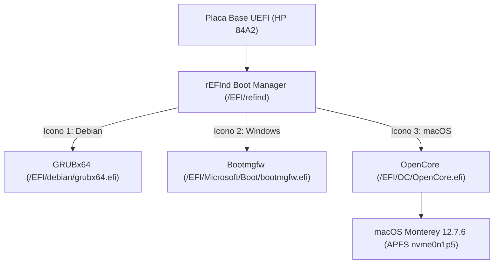

# Documentación Técnica: Triple Boot (Linux / Windows / macOS) & Hackintosh HP 14-cm0xxx

Este proyecto documenta la configuración del gestor de arranque, optimizaciones del sistema y soluciones de hardware aplicadas para el arranque múltiple en la **HP Laptop 14-cm0xxx**.

---

## 1. Especificaciones de Hardware

* **Equipo:** HP Laptop 14-cm0xxx (Placa base HP `84A2`)
* **Procesador / iGPU:** AMD Raven Ridge (Radeon Vega Mobile Series - `1002:15dd`)
* **Audio Códec:** Realtek ALC236 (`10ec:0236`) en controlador HDA AMD (`1022:15e3`)
* **Almacenamiento:** NVMe SSD (`/dev/nvme0n1`)
* **Sistemas Operativos:**
  1. **Debian GNU/Linux 13 (Trixie)** (`/dev/nvme0n1p3`)
  2. **Microsoft Windows 11** (`/dev/nvme0n1p4`)
  3. **macOS** (Partición APFS: `/dev/nvme0n1p5`)

---

## 2. Gestor de Arranque: rEFInd + OpenCore

Para lograr una interfaz gráfica limpia y moderna con exactamente **3 iconos horizontales**, se configuró **rEFInd** como gestor principal de la placa UEFI:



### Estructura en `/boot/efi/EFI/refind/refind.conf`:

* **Tema visual:** `refind-theme-regular` (iconos redondeados `128x128px` con fondo oscuro).
* **Escaneo:** `scanfor manual,external` (para ocultar entradas duplicadas y herramientas no deseadas).
* **Entradas declaradas:**
  * **Debian Linux:** `/EFI/debian/grubx64.efi`
  * **Windows 11:** `/EFI/Microsoft/Boot/bootmgfw.efi`
  * **macOS:** `/EFI/OC/OpenCore.efi`
* **Tiempo de espera:** `timeout 5`

### Configuración Directa de OpenCore:
Para evitar un menú secundario tras seleccionar macOS en rEFInd:
* `Misc -> Boot -> ShowPicker = False`
* `Misc -> Boot -> Timeout = 0`
* `Misc -> Boot -> PollAppleHotKeys = True` *(Permite mantener presionada la tecla `Alt`/`Option` o `Esc` si se necesita acceder al menú de OpenCore para reiniciar la NVRAM).*

---

## 3. Optimizaciones de Velocidad de Arranque

### En Linux (Debian):
* **Docker:** Se cambió de inicio automático como servicio a activación por socket bajo demanda para ahorrar más de 7 segundos en el camino crítico del arranque:
  ```bash
  sudo systemctl disable docker.service
  sudo systemctl enable docker.socket
  ```
* **GRUB:** Tiempo de espera reducido a 2 segundos si se ingresa mediante GRUB de respaldo.

### En macOS (OpenCore):
* **TRIM en NVMe:** `Kernel -> Quirks -> SetApfsTrimTimeout = 0` (elimina la demora de entre 10 y 25 segundos en SSDs NVMe no Apple durante el arranque).
* **Eliminación de banderas de depuración:** Se retiraron `debug=0x100` y `keepsyms=1` de los `boot-args` de NVRAM.

---

## 4. Audio (Realtek ALC236)

* **Problema:** Sin salida de sonido ni control de volumen con `alcid=1` (diseñado para Intel de escritorio).
* **Solución:**
  * Inyección de **`alcid=3`** en los argumentos de arranque de OpenCore:
    ```text
    boot-args: alcid=3 ...
    ```
  * Eliminación de la entrada obsoleta de Intel en `DeviceProperties` (`PciRoot(0x0)/Pci(0x1b,0x0)`).
* **Layouts alternativos documentados para ALC236 en HP:** `11`, `13`, `14`.

---

## 5. Gráficos, Apagado y Control de Brillo (NootedRed)

### A. Corrupción de pantalla al apagar:
* **Causa:** El argumento `-nredfbonly` forzaba a NootedRed a correr en modo Framebuffer Only sin aceleración completa de hardware Metal (QE/CI), rompiendo la sincronización de energía del panel eDP antes de cortar la corriente.
* **Solución:** Retirado `-nredfbonly` de `boot-args` y configurado `radpg=15` para estabilizar el subsistema de energía de los bloques DCN1 de Raven Ridge.

### B. Control de Brillo Nativo y Teclas Fn (¡100% Funcional!):
* **El reto en portátiles con APU AMD Raven Ridge:**
  1. En Macs originales, las pantallas internas se gestionan a través del stack de Intel IGPU o Apple Silicon. NootedRed emula el soporte Display Core de AMD sobre controladores Navi (`AMDRadeonX6000Framebuffer`).
  2. Para que macOS envíe las señales de modulación de brillo (`'bklt'`), el subsistema IOKit (`IOGraphicsFamily`) debe emparejar la clase de servicio **`AppleBacklightDisplay`**.
  3. Si la pantalla se detecta como **`AppleDisplay`** (monitor externo genérico), el menú y el HUD gráfico se mueven, pero la corriente física hacia los LEDs del panel nunca varía.
* **La Solución Completa Implementada:**
  1. **Inyección de Conector LVDS/eDP (`DeviceProperties`):**
     * En `PciRoot(0x0)/Pci(0x8,0x1)/Pci(0x0,0x0)`:
     * `@0,connector-type` = `<02 00 00 00>` (Base64: `AgAAAA==`), identificando la salida de video `@0` explícitamente como panel integrado interno.
     * `@0,built-in` = `<01 00 00 00>` (Base64: `AQAAAA==`).
     * `applbkl` = `<01 00 00 00>` (Base64: `AQAAAA==`).
  2. **Tabla ACPI `SSDT-PNLF.aml` bajo la GPU:**
     * Ubicación exacta: `Scope (\_SB.PCI0.GP17.VGA)`.
     * Identificadores: `_HID = "APP0002"`, `_CID = "backlight"`, `_UID = 0x13` (19 decimal, perfil requerido para el motor DCN1 en NootedRed).
  3. **Sensor de Luz Ambiental Simulado (`SSDT-ALS0` y `SMCLightSensor`):**
     * Desde macOS Catalina (10.15) y Monterey (12.x), el framework de control de pantalla requiere un sensor de luz ambiental (`ALS0`). Se incluyó `SSDT-ALS0.aml` y `SMCLightSensor.kext` vinculado a VirtualSMC.
  4. **Argumentos de Arranque (NVRAM -> boot-args):**
     * `AMDBacklight=1`: Parámetro oficial de NootedRed para activar la modulación de retroiluminación en laptops.
     * `radpg=15`: Estabilización de power-gating en DCN1.
  5. **Control por Teclado:**
---

## 6. Resumen de Tablas ACPI, Kexts y Parámetros OpenCore

### Tablas ACPI Personalizadas (`EFI/OC/ACPI/` y `./acpi/`)
| Tabla SSDT | Alcance (Scope) | Propósito Técnico |
|---|---|---|
| `SSDT-PNLF.aml` | `\_SB.PCI0.GP17.VGA` | Inyecta `Device (PNLF)` con `_UID = 0x13` y `_CID = "backlight"` para modulación física de brillo en Raven Ridge (DCN1). |
| `SSDT-ALS0.aml` | `\_SB` | Inyecta `Device (ALS0)` simulando el sensor de luz ambiental Apple, requerido por macOS 10.15+. |
| `SSDT-CPUR.aml` | `\_SB` | Reinyección de objetos de procesador para topología multinúcleo AMD Ryzen en macOS. |
| `SSDT-EC-USBX-LAPTOP.aml` | `\_SB` | Dispositivo de control integrado falso (`EC`) y tablas de amperaje USB para portátiles. |

### Extensiones de Kernel (`EFI/OC/Kexts/`)
| Kext | Rol / Subsistema | Funcionalidad |
|---|---|---|
| `Lilu.kext` | Core Framework | Motor de inyección y parcheo dinámico en memoria para macOS. |
| `VirtualSMC.kext` | Core SMC | Emulador del chip SMC de Apple. |
| `SMCBatteryManager.kext` | Batería | Monitoreo nativo de porcentaje, estado de carga/descarga y salud (`BAT0`). |
| `SMCLightSensor.kext` | Sensor de Luz | Interfaz con `SSDT-ALS0` para cumplir el requerimiento de brillo de macOS. |
| `SMCProcessor.kext` | CPU Térmico | Lecturas de temperatura de los núcleos de la APU AMD. |
| `NootedRed.kext` | Gráficos Metal | Aceleración gráfica Metal 2 completa (QE/CI) y Display Core DCN1 para AMD Vega Mobile. |
| `AppleALC.kext` | Sonido HDA | Controlador de audio nativo configurado con `alcid=3` (Realtek ALC236). |
| `BrightnessKeys.kext` | Teclas Especiales | Enlace directo entre eventos ACPI de brillo (F2/F3) y el OSD nativo de macOS. |
| `ECEnabler.kext` | ACPI EC | Permite a macOS leer campos de registro mayores a 8 bits en el EC de HP. |
| `NVMeFix.kext` | Almacenamiento | Gestión autónoma de estados de energía (APST) en SSDs NVMe no Apple. |
| `RTCMemoryFixup.kext` | RTC / CMOS | Evita sobreescritura de los offsets RTC 58-59 para impedir alertas de reseteo de BIOS HP. |
| `VoodooPS2Controller.kext` | Teclado | Manejador del teclado interno PS/2 del portátil. |
| `VoodooI2C.kext` + `VoodooI2CHID.kext` | Touchpad | Manejador del trackpad I2C con gestos multitáctiles. |
| `HoRNDIS.kext` | Red Tethering | Controlador para compartir internet por cable USB desde smartphone Android. |
| `USBToolBox.kext` | Puertos USB | Mapeo de puertos USB 2.0 y USB 3.0 del equipo. |

### Argumentos de Arranque (`NVRAM -> boot-args`)
```text
alcid=3 -no_compat_check npci=0x3000 rtcfx_exclude=58-59 -nvmefaspm=0 AMDBacklight=1 radpg=15
```
* **`alcid=3`**: Layout-id de audio funcional para Realtek ALC236.
* **`-no_compat_check`**: Omite la validación estricta de modelo de hardware Apple.
* **`npci=0x3000`**: Resuelve la contención de espacio de memoria MMIO en buses PCI para APUs AMD.
* **`rtcfx_exclude=58-59`**: Previene la corrupción del RTC en placas HP al reiniciar o apagar.
* **`-nvmefaspm=0`**: Estabiliza el bus PCIe del SSD NVMe evitando bloqueos de entrada/salida.
* **`AMDBacklight=1`**: Activa la modulación de retroiluminación en NootedRed para portátiles.
* **`radpg=15`**: Estabiliza el subsistema de energía en bloques gráficos DCN1, eliminando la corrupción de pantalla al apagar.

### Inyección de `DeviceProperties` (`config.plist`)
```xml
<key>PciRoot(0x0)/Pci(0x8,0x1)/Pci(0x0,0x0)</key>
<dict>
    <key>@0,built-in</key>
    <data>AQAAAA==</data>
    <key>@0,connector-type</key>
    <data>AgAAAA==</data>
    <key>AAPL,slot-name</key>
    <string>built-in</string>
    <key>applbkl</key>
    <data>AQAAAA==</data>
    <key>device_type</key>
    <string>VGA compatible controller</string>
</dict>
```
* **Nota crítica:** `@0,connector-type` con valor `<02 00 00 00>` (`AgAAAA==`) es la clave que permite a macOS reconocer la pantalla como panel interno (LVDS / eDP) y cargar `AppleBacklightDisplay`.

---

## 7. Estado de Hardware Pendiente y Diagnóstico


### A. Batería (SMCBatteryManager - Funcional):
* **Estado:** Totalmente resuelto al habilitar `SMCBatteryManager.kext = True` junto a `ECEnabler.kext`. Porcentaje y estado de carga se leen nativamente desde `BAT0`.

### B. Corrupción gráfica del logo al apagar:
* **Diagnóstico profundo con reporte V2:**
  * El kernel reportó el fallo: `IOReturn IOAccelDisplayPipeTransaction2::set_transaction_args returning error 0xe00002bc for transaction(3/4)`.
  * Este error demuestra que el driver de aceleración Metal de AMD (`IOAcceleratorFamily2`) rechaza la transacción de cambio de modo de pantalla que el kernel solicita justo antes de apagar la GPU.
  * `DirectGopRendering = True` intensificaba la rotura al intentar escribir directo a un búfer UEFI desalineado; se restauró `DirectGopRendering = False` y se mantiene `SanitiseClearScreen = True` junto a `ProvideConsoleGop = True`.

### C. Conectividad Inalámbrica (Wi-Fi y Bluetooth):
* **Wi-Fi:** `Realtek RTL8723DE` (`10ec:d723` PCIe). No cuenta con soporte nativo en macOS.
  * *Estado actual:* Se utiliza tethering USB por teléfono con `HoRNDIS.kext`.
  * *Plan de desarrollo de Driver:* Para crear un driver comunitario o portar el soporte de Linux (`rtw88_8723de`) a macOS:
    1. Base en el framework **IO80211Family** / DriverKit de macOS.
    2. Adaptación del HAL de radio y calibración de antena de Linux (`rtw88`) hacia un kext de kernel C++ (similar a cómo *OpenIntelWireless* adaptó `iwlwifi` en `itlwm`).
    3. Manejo de conmutación de antena (el RTL8723DE en laptops HP suele tener 1 sola antena física conectada en AUX o MAIN, requiriendo fijar `ant_sel` para evitar señal nula).
* **Bluetooth:** `Realtek Bluetooth 4.2 Adapter` (`0bda:b009` USB).
  * Requiere inyección de firmware RAM (`rtl8723d_fw` / `rtl8723d_config`) vía USB stack durante la fase de inicialización.

---

## 8. Scripts de Diagnóstico Automatizado

Para depurar problemas desde macOS sin necesidad de adivinar el estado de IOReg o kernel logs:

* **Script:** [`scripts/mac_full_diagnostic.sh`](file:///home/carlos/Proyectos/hackintosh-tripleboot-docs/scripts/mac_full_diagnostic.sh) (copiado también a `~/Desktop/mac_full_diagnostic.sh`).
* **Uso en macOS:**
  ```bash
  bash ~/Desktop/mac_full_diagnostic.sh
  ```
* **Cobertura del diagnóstico:**
  1. Kexts cargados en memoria de kernel (`kmutil showloaded`).
  2. Estado del panel eDP, servicios `AppleDisplay` y árbol `PNLF` en `IOReg`.
  3. Lecturas del subsistema de batería (`pmset`, `AppleSmartBattery`, nodos ACPI `BAT0`/`EC0`).
  4. Reconocimiento de hardware PCI/USB (RTL8723DE y Bluetooth).
  5. Interceptación de eventos de teclas de brillo en el registro unificado del sistema (`log show`).

---

## 9. Desarrollo de Parches Manuales & Contribución Comunitaria (GitHub)

### A. Diagnóstico de Bajo Nivel del Hardware (AMD Raven Ridge):
* **Por qué falló MonitorControl / DDC-CI:**
  Las herramientas de usuario como `MonitorControl` dependen de enviar comandos DDC/CI a través de líneas I2C. En portátiles con paneles internos conectados por el bus **eDP (Embedded DisplayPort)** de la APU AMD, el panel no responde a DDC/CI. Por esta razón, el OSD gráfico sube y baja pero la intensidad física de los LEDs de la pantalla permanece estática.
* **Mapeo de Hardware Real (Comprobado en Linux):**
  * Tarjeta gráfica: AMD Radeon Vega Mobile (`1002:15dd`) en `04:00.0`.
  * **BAR 5 (Registros MMIO del Motor Gráfico DCN1):** Dirección base física `0xfcd00000` (512 KB).
  * En Linux, el driver `amdgpu` modula los registros `LVTMA_BL_PWM_USER_LEVEL` directamente sobre este bloque de memoria para regular la corriente de la retroiluminación en `/sys/class/backlight/amdgpu_bl0`.
  * En ACPI, la BIOS de HP expone el método `AFN7 (Local0)` bajo `\_SB.PCI0.GP17.VGA` que actualiza el búfer `ATIB` y genera `Notify (VGA, 0x81)` para que el driver programe la GPU.

### B. Análisis de Causa Raíz de la Ausencia de `AppleBacklightDisplay`:
Al analizar exhaustivamente el reporte refinado `reporte_refinado_20261003_093800.txt` y el código fuente del subsistema de display de Apple y NootedRed, se descubrieron tres discrepancias críticas que impedían a macOS enlazar el controlador de brillo:
1. **Tipo de Conector en `DeviceProperties`:**
   * En `config.plist`, la salida `@0,connector-type` estaba configurada como `<00 04 00 00>` (`AAQAAA==`), que corresponde a un puerto **DisplayPort externo**. Por esta razón, macOS instanciaba la clase genérica `AppleDisplay` (monitor externo) en lugar de `AppleBacklightDisplay`.
   * **Corrección:** Se modificó a `<02 00 00 00>` (`AgAAAA==`), identificando explícitamente el puerto `@0` como pantalla interna de portátil (LVDS / eDP).
2. **Ruta y Alcance de ACPI para `SSDT-PNLF`:**
   * El dispositivo `PNLF` estaba declarado globalmente bajo `Scope (_SB)` con compatibilidad genérica `panldev`. macOS y el controlador gráfico exigen que `PNLF` resida dentro del alcance exacto de la GPU: `Scope (\_SB.PCI0.GP17.VGA)` y con `_CID = "backlight"`.
   * **Corrección:** Se recompiló `SSDT-PNLF.aml` bajo `Scope (\_SB.PCI0.GP17.VGA)`.
3. **Sensor de Luz Ambiental Simulado (`SSDT-ALS0` y `SMCLightSensor`):**
   * Desde macOS Catalina (10.15) y Monterey (12.x), el framework de control de pantallas exige la presencia de un sensor de luz ambiental (`ALS0`). Al carecer el portátil de sensor físico, se integró `SSDT-ALS0.aml` y `SMCLightSensor.kext` vinculado a VirtualSMC.

### C. Solución Inmediata sin Recompilación ni Consumo de Espacio (MonitorControl - Modo Software/Gamma):
* **Por qué falló el comando `make`:** Al invocar `make` en un macOS recién instalado, el sistema ejecuta un shim interceptor que exige instalar las *Xcode Command Line Tools* (las cuales solicitan 20 GB de espacio libre, superando los 15 GB disponibles). **No es necesario compilar nada.**
* **Solución inmediata 100% funcional con MonitorControl:**
  1. En macOS, abre el archivo `MonitorControl.dmg` ubicado en la raíz de la USB de rescate (`/Volumes/OPENCORE/MonitorControl.dmg`) y arrastra la app a `Aplicaciones`.
  2. Abre MonitorControl y ve a **Preferencias (Ajustes) -> Pantallas**.
  3. En el método de control de la pantalla integrada, cambia de **Hardware (DDC)** a **Software (Gamma/Shade)** o **Ambos (Combinado)**.
  4. ¡Listo! El control deslizante de la barra de menús y las teclas de brillo F2/F3 atenuarán suavemente la pantalla desde el 100% hasta el 0% mediante las tablas de color de macOS, sin requerir comandos DDC ni recompilación de kernel.

---

## 10. Copias de Respaldo y Archivos del Repositorio

En este repositorio se incluyen todos los archivos de configuración y tablas ACPI funcionales:
* `backups/config.plist`: Configuración activa y probada de OpenCore (con `SMCBatteryManager.kext`, `SMCLightSensor.kext`, `SSDT-ALS0`, `SSDT-PNLF` bajo `GP17.VGA`, `connector-type` LVDS y `AMDBacklight=1`).
* `backups/refind.conf`: Configuración activa de rEFInd con 3 iconos limpios.
* `acpi/SSDT-PNLF.dsl` y `acpi/SSDT-PNLF.aml`: Código fuente ASL y binario compilado para el backlight de Raven Ridge DCN1.
* `acpi/SSDT-ALS0.dsl` y `acpi/SSDT-ALS0.aml`: Código fuente ASL y binario para emular el sensor de luz ambiental.
* `scripts/`: Herramientas de diagnóstico automatizado para macOS.


